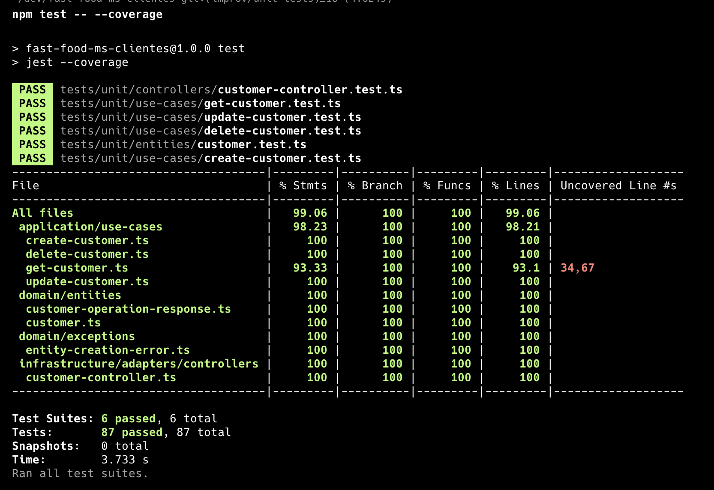
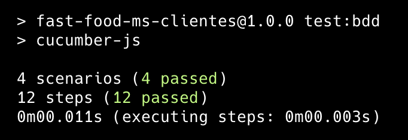

# Customer Management System

## Description

This Customer Management System is a robust, TypeScript-based application designed to handle CRUD (Create, Read, Update, Delete) operations for customer data. It follows a hexagonal architecture pattern and implements Test-Driven Development (TDD) practices.

## Features

- Create new customers
- Retrieve customer information
- Update existing customer details
- Delete customers
- Search for customers based on various criteria
- Containerized application using Docker

## Technologies Used

- TypeScript
- Node.js
- MongoDB (as the database)
- Jest (for unit testing)
- Cucumber.js (for BDD testing)
- Docker

## Project Structure

The project follows a hexagonal architecture with the following main components:

- Domain: Contains the core business logic and entities
- Application: Houses the use cases that orchestrate the flow of data
- Infrastructure: Manages external concerns like databases and frameworks

## Prerequisites

- Node.js (v14 or later)
- npm (v6 or later)
- Docker and Docker Compose (for containerized deployment)
- MongoDB (if running locally without Docker)

## Setup

1. Clone the repository:
   ```
   git clone https://github.com/your-username/customer-management-system.git
   cd customer-management-system
   ```

2. Install dependencies:
   ```
   npm install
   ```

3. Set up environment variables:
   Create a `.env` file in the root directory and add the following variables:
   ```
   MONGODB_URI=mongodb://localhost:27017/customer_db
   PORT=3000
   ```

## Running the Application

### Local Development

1. Start the application:
   ```
   npm run start:dev
   ```

2. The server will be running at `http://localhost:3000`

### Using Docker

1. Build and start the Docker containers:
   ```
   docker-compose up --build
   ```

2. The server will be running at `http://localhost:3000`

## Running Tests

- Run unit tests:
  ```
  npm run test
  or
  npm run test -- --coverage
  ```

  


- Run BDD tests:
  ```
  npm run test:bdd
  ```


## API Endpoints

- POST /customers - Create a new customer
- GET /customers/:id - Retrieve a customer by ID
- PUT /customers/:id - Update a customer
- DELETE /customers/:id - Delete a customer
- GET /customers - List all customers (with optional query parameters for filtering)